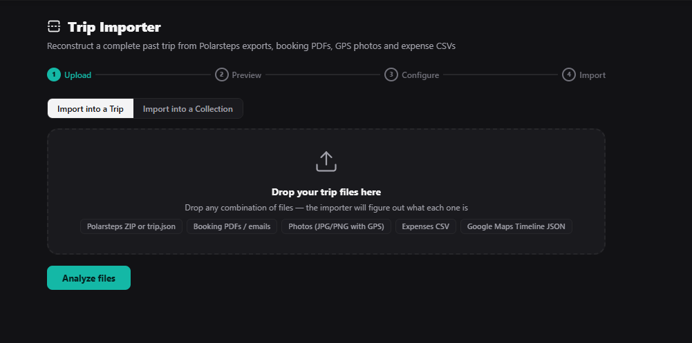

# Trip Importer

## What it does

Reconstructs a complete past trip from any combination of data sources — drop your files and the importer creates the trip, journal, places, transports, accommodations and costs automatically. Point it at a Polarsteps export, a folder of GPS photos, an expense spreadsheet, or all of the above at once, and it builds out the trip planner for you instead of you doing it by hand.

Also supports **journal-only mode**: if you just want a travel story/journal from your Polarsteps data without engaging the full trip-planning machinery (no places, no calendar days, no bookings/costs), you can create a standalone journey with nothing else attached.

And **Collection mode**: import places into one of your Collections (a saved-place list, independent of any trip) instead of a trip plan — from a Google Maps "Saved places" export, a KML/KMZ custom map, a plain CSV place list, or by just **pasting a shared Google Maps or Naver Maps list link** directly (no export file needed). Switch to it with the "Import into a Collection" toggle on the first step.

## What it imports

| File type | What gets created |
|---|---|
| **Polarsteps ZIP** or `trip.json` | Journey with entries + places with GPS coordinates, timezone-aware dates, multi-day stays, trip cover photo, and trip summary as an intro entry |
| **Booking confirmation PDFs** | PDF uploaded as a trip file (use Transports → Automated import to finish) |
| **Booking text / .eml** | Flight/bus/train reservations and hotel accommodations parsed by pattern matching |
| **ICS calendar files** | Transport and accommodation bookings from calendar events |
| **Photos with GPS EXIF** (JPG/PNG) | Places pinned to the map, grouped by date and location |
| **Google Photos Takeout** | GPS/date read from each photo's sidecar JSON, preferred over EXIF |
| **GPX tracks / KML / KMZ** | Places from waypoints and placemarks |
| **Google Maps Timeline** (`location-history.json` / `Records.json`) | Places clustered from location history |
| **Expense CSV** | Cost entries with auto-detected categories, localized number formats handled |
| **Google Maps "Saved places" export, KML/KMZ, place-list CSV, or a pasted Google/Naver Maps list link** *(Collection mode only)* | Places saved into a Collection instead of a trip |

A Polarsteps ZIP with multiple trips detected inside becomes multiple separate TREK trips, each auto-scoped to its own dates — nothing gets dumped into one trip by mistake. Large trips (100+ Polarsteps steps, big expense CSVs, hundreds of GPS clusters) are automatically paginated across several import calls so nothing gets rejected for being too large in one request.

## Screenshots

 

## Setup

1. Install and activate the plugin, approving the requested permissions (see below).
2. Optional — for the photo-search feature: go to your own **Settings → Plugins → Trip Importer** and set **TREK public base URL** to the address you personally access this TREK instance at (e.g. `https://trek.example.com`). This is per-user, not an admin setting. *(Note: as of the current TREK release, no photo picker in TREK's UI actually queries this yet — the plugin side is ready and correct, but there's nothing on TREK's side consuming it yet. Safe to leave unset until that changes.)*
3. Open **Trip Importer** from the main navigation, drop your files, and follow the wizard.

## How to use

1. Drop any files — ZIP, PDFs, photos, CSVs, GPX/KML, ICS — all at once
2. The importer detects each file type and shows a preview per source — review and deselect anything you don't want
3. Configure: create a new trip or link to an existing one, toggle what to import (or switch to journal-only mode for just a story with no trip plan)
4. Import — progress shown per step, each source runs in sequence, automatically resuming across multiple calls for larger trips
5. If something went wrong, use **Undo this import** on the results screen to remove everything the import just created

## Notes

- **GPS places** are reverse-geocoded via Nominatim (OpenStreetMap) to get real location names — rate limited to 1 request/second, so large imports may be split across multiple runs
- **GPS places** within 800m of an existing Polarsteps stop are deduplicated automatically; two visits to the same place on different days are kept as separate itinerary entries, not merged into one
- **PDF bookings** are uploaded as trip files — TREK's native booking parser runs separately (Transports tab → Automated import button)
- **AI assist** button appears if pattern matching finds nothing in text/email confirmations — requires an AI provider configured in Admin settings
- **Undo** removes reservations, accommodations, costs, places and journal entries created by the import — it does not delete the trip itself or its calendar days
- **Duplicate detection**: re-importing the same Polarsteps trip prompts for confirmation instead of silently creating a second copy
- Imported photos attach to the trip's **Files** tab (optionally linked to a place) — TREK has no way for a plugin to attach a photo directly into a journal entry's own gallery; this is a platform limitation, not something this plugin can work around
- **Collection mode**: the Google Maps "Saved places" export parser is best-effort against the general Takeout GeoJSON shape and hasn't been verified against a real export — if your file doesn't parse, please report it (with a sanitized sample if possible) so the parser can be adjusted; KML/KMZ and CSV place-list parsing reuse the same well-tested code paths as the trip importer's other sources
- **Pasting a shared list link** (Google Maps or Naver Maps) uses the same undocumented internal endpoints TREK's own core "List Import" feature uses — it isn't an official API and could break if either service changes it; a single-*place* share link (as opposed to a *list*) isn't supported, since it carries no list to import — paste that into TREK's own place search instead
- **GPS photos, GPX/KML tracks, and Google Maps Timeline exports** are all clustered into places entirely in your browser before anything is sent to the server — needed because the plugin-route proxy enforces a hard ~100KB request body limit, and any of these can easily produce a raw point list bigger than that for a large trip (a Timeline export in particular is routinely several MB)
- **Booking text (PDFs/.txt/.eml), expense CSVs, and Google Maps "Saved places" exports** are windowed into several requests client-side (same ~60KB-per-call budget used elsewhere) instead of being sent whole, for the same reason

## Known limitations

- **TREK's plugin-route proxy caps every request body at ~100KB**, enforced before the plugin's own route handler runs — a request over that limit gets rejected with an HTTP 413 that **never reaches this plugin's own error handling or logs**, so the only visible symptom in the TREK UI is the import spinner never finishing. If an import seems to hang indefinitely rather than showing an error, this is the most likely cause. Every known source of this has now been windowed or moved client-side (see the Notes above) — if you still hit it, please report it with the file size/type involved.

## Permissions

| Permission | Why |
|---|---|
| `db:read:trips` | List your existing trips (to link an import to one) and check for duplicate Polarsteps re-imports |
| `db:create:trips` | Create a new trip for an import |
| `db:write:trips` | Set the trip's cover photo from the Polarsteps export |
| `db:write:journal` | Create the journey and journal entries from Polarsteps steps |
| `db:write:places` | Create places from GPS photos, Polarsteps stops, GPX/KML, and Google Timeline |
| `db:write:days` | Create calendar day rows so places/bookings can be assigned to a day |
| `db:write:itinerary` | Assign places to specific days in the itinerary |
| `db:write:reservations` | Create flight/bus/train bookings |
| `db:write:accommodations` | Create hotel stays |
| `db:write:costs` | Create expense entries |
| `db:read:files` | List a trip's existing files (used by the photo-search feature) |
| `db:write:files` | Attach uploaded photos and PDF booking confirmations to the trip |
| `db:write:daynotes` | Add Polarsteps step descriptions as day notes |
| `db:read:daynotes` | Read existing day notes (paired with the write permission above) |
| `db:meta` | Store the Polarsteps trip's own uuid, to detect and warn on duplicate re-imports |
| `db:read:collections` | List your existing Collections for the "add to existing" picker in Collection mode |
| `db:write:collections` | Create a Collection and save imported places into it |
| `ai:invoke` | Optional AI fallback when pattern-matching finds no bookings in a text/email confirmation |
| `hook:photo-provider` | Makes imported photos searchable through TREK's native photo picker (not yet consumed by any picker UI in the current TREK release — see Setup) |
| `http:outbound:nominatim.openstreetmap.org` | Reverse geocoding for GPS places |
| `http:outbound:polarsteps.s3.amazonaws.com` | Fetching the trip cover photo and step photos directly from Polarsteps' own CDN |
| `http:outbound:www.google.com` | Resolving a pasted Google Maps list link and fetching its places (Collection mode) |
| `http:outbound:maps.app.goo.gl` / `http:outbound:goo.gl` | Following a shortened Google Maps list link to its real URL |
| `http:outbound:naver.me` | Following a shortened Naver Maps list link to its real URL |
| `http:outbound:pages.map.naver.com` | Fetching a shared Naver Maps list's places |
